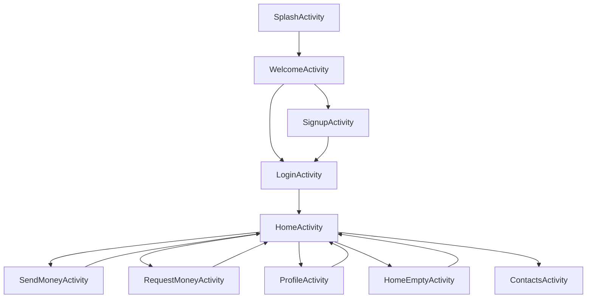

# Alke Wallet

Aplicación de billetera virtual Android desarrollada como entrega del **Módulo 6 (ABP)**.

Implementa autenticación local, transferencias entre usuarios, gestión de contactos, historial de transacciones e imagen de perfil con Picasso — todo con arquitectura **MVVM**, **Room** y **Coroutines**.

---

## Tecnologías utilizadas

| Capa | Tecnología |
|---|---|
| Lenguaje | Kotlin |
| Arquitectura | MVVM (ViewModel + StateFlow) |
| Base de datos local | Room 2.7 |
| Red | Retrofit 2.11 + OkHttp logging |
| Imágenes | Picasso 2.8 |
| Concurrencia | Kotlin Coroutines 1.9 |
| Inyección de dependencias | Manual (ViewModelFactory) |
| Pruebas | JUnit 4 + Mockito-Kotlin 5.4 + coroutines-test |
| Build | Gradle KTS + KSP |

---

## Arquitectura MVVM

```
UI (Activity)
  │  observa StateFlow
  ▼
ViewModel  ──►  Repository  ──►  DAO (Room)  ──►  SQLite
                           ──►  RetrofitClient (API)
```

- **Activities**: solo manejan UI y eventos de usuario.
- **ViewModels**: contienen la lógica de negocio, exponen `StateFlow` y nunca referencian `Context`.
- **Repositories**: abstraen el origen de datos (Room o Retrofit).
- **Entities/DAOs**: definen el esquema de la BD y las consultas.

---

## Estructura del proyecto

```text
app/src/main/java/com/cjgr/awandroide/
├── data/
│   ├── local/
│   │   ├── AppDatabase.kt          # Room DB v2, fallbackToDestructiveMigration
│   │   ├── UserEntity.kt           # id, nombre, correo, password, saldo, fotoPerfil, token
│   │   ├── UserDao.kt              # CRUD + updateFotoPerfil
│   │   ├── TransactionEntity.kt
│   │   ├── TransactionDao.kt
│   │   ├── ContactEntity.kt
│   │   └── ContactDao.kt
│   └── repository/
│       ├── UserRepository.kt
│       ├── TransactionRepository.kt
│       └── ContactRepository.kt
├── network/
│   ├── RetrofitClient.kt
│   └── ApiService.kt
├── ui/
│   ├── viewmodel/
│   │   ├── AuthViewModel.kt        # login, registrar, actualizarPerfil, actualizarFotoPerfil
│   │   ├── TransactionViewModel.kt # ingresarDinero, realizarTransferencia, cargarTransacciones
│   │   ├── ContactViewModel.kt
│   │   ├── ViewModelFactory.kt
│   │   └── AuthState / TransactionState (sealed classes)
│   ├── SplashActivity.kt
│   ├── WelcomeActivity.kt
│   ├── LoginActivity.kt
│   ├── SignupActivity.kt
│   ├── HomeActivity.kt
│   ├── HomeEmptyActivity.kt
│   ├── ProfileActivity.kt          # Picasso + selector de galería
│   ├── SendMoneyActivity.kt        # Contacto guardado ó correo manual
│   ├── RequestMoneyActivity.kt
│   └── ContactsActivity.kt
app/src/test/java/com/cjgr/awandroide/
├── AuthViewModelTest.kt            # 9 pruebas
├── TransactionViewModelTest.kt     # 7 pruebas
└── UserRepositoryTest.kt           # 8 pruebas
```

---

## Flujo de navegación



---

## Funcionalidades implementadas

### Autenticación
- Registro con validación de correo duplicado.
- Login con credenciales almacenadas en Room.
- Cierre de sesión limpia el estado del ViewModel.

### Perfil de usuario
- Edición de nombre y correo con validaciones (vacío, formato, correo en uso).
- **Imagen de perfil con Picasso**: el usuario abre la galería del dispositivo con `ACTION_OPEN_DOCUMENT`, se persiste el permiso de lectura con `takePersistableUriPermission` y la URI se guarda en Room. Picasso la carga con `placeholder` y `error` apuntando a `ic_profile`.

### Transferencias
- Ingreso de dinero propio.
- Transferencia a cualquier correo (el destinatario no necesita estar registrado localmente).
- Si el destinatario existe en Room, se registra automáticamente su ingreso.
- Validación de saldo suficiente antes de procesar.

### Destinatario en SendMoney
- Seleccionar un contacto guardado.
- Agregar un nuevo contacto (navega a `ContactsActivity`).
- Ingresar correo manualmente (toggle con `EditText`).

### Historial
- Transacciones ordenadas por fecha descendente.
- Balance calculado como suma de todos los montos del historial.

---

## Pruebas unitarias

Las pruebas usan **JUnit 4**, **Mockito-Kotlin** y **kotlinx-coroutines-test** con `UnconfinedTestDispatcher`. No requieren emulador ni dispositivo físico.

### Ejecutar todas las pruebas

```bash
./gradlew test
```

O desde Android Studio: clic derecho sobre la carpeta `test` → **Run Tests**.

---

### `AuthViewModelTest` — 9 pruebas

| # | Prueba | Resultado esperado |
|---|---|---|
| 1 | `login correcto` | `AuthState.LoginSuccess` con el usuario |
| 2 | `login credenciales incorrectas` | `AuthState.Error` |
| 3 | `registrar usuario nuevo` | `AuthState.RegisterSuccess` con id=5 |
| 4 | `registrar correo duplicado` | `AuthState.Error` con mensaje "registrado" |
| 5 | `actualizarPerfil datos válidos` | `AuthState.ProfileUpdated` con nombre actualizado |
| 6 | `actualizarPerfil nombre vacío` | `AuthState.Error` |
| 7 | `actualizarPerfil correo inválido` | `AuthState.Error` |
| 8 | `actualizarPerfil correo en uso por otro` | `AuthState.Error` con mensaje "uso" |
| 9 | `actualizarFotoPerfil` | `AuthState.PhotoUpdated` con URI guardada |
| 10 | `cerrarSesion` | `currentUser = null`, estado `Idle` |

---

### `TransactionViewModelTest` — 7 pruebas

| # | Prueba | Resultado esperado |
|---|---|---|
| 1 | `ingresarDinero usuario válido` | `Success` o `Idle` (internamente llama cargarTransacciones) |
| 2 | `ingresarDinero usuario inexistente` | `Error("Usuario no encontrado")` |
| 3 | `realizarTransferencia exitosa` | `Success` o `Idle` |
| 4 | `realizarTransferencia saldo insuficiente` | `Error("Saldo insuficiente")` |
| 5 | `realizarTransferencia remitente inexistente` | `Error("Usuario no encontrado")` |
| 6 | `realizarTransferencia registra ingreso destinatario local` | `enviarTransaccion` llamado con `userId=2, tipo="ingreso"` |
| 7 | `cargarTransacciones ordena por fecha desc` | Lista con `18/04 > 10/04 > 01/04` |
| 8 | `resetState devuelve Idle` | `TransactionState.Idle` |

---

### `UserRepositoryTest` — 8 pruebas

| # | Prueba | Resultado esperado |
|---|---|---|
| 1 | `registrar llama insertUser` | Retorna id, verifica llamada al DAO |
| 2 | `buscarPorCorreo existente` | Retorna `UserEntity` con nombre correcto |
| 3 | `buscarPorCorreo inexistente` | Retorna `null` |
| 4 | `actualizarSaldo llama updateSaldo` | Verifica parámetros en DAO |
| 5 | `actualizarPerfil llama updatePerfil` | Verifica parámetros en DAO |
| 6 | `actualizarFotoPerfil llama updateFotoPerfil` | Verifica URI en DAO |
| 7 | `login credenciales correctas` | Retorna `UserEntity` |
| 8 | `login credenciales incorrectas` | Retorna `null` |

---

## Cómo ejecutar el proyecto

1. Clonar el repositorio y cambiarse al branch de entrega:
   ```bash
   git clone https://github.com/Carl0gonzalez/AlkewalletEvaluacionGeneral.git
   cd AlkewalletEvaluacionGeneral
   git checkout entregamodulo6
   ```
2. Abrir en **Android Studio** y esperar la sincronización de Gradle.
3. Seleccionar un AVD con API 24+ y pulsar **Run**.
4. Para ejecutar las pruebas unitarias:
   ```bash
   ./gradlew test
   ```

---

## Autor
Carlo J. González Rojas  
Proyecto desarrollado como parte del programa de formación Android — **Módulo 6 · Alke Wallet**.
